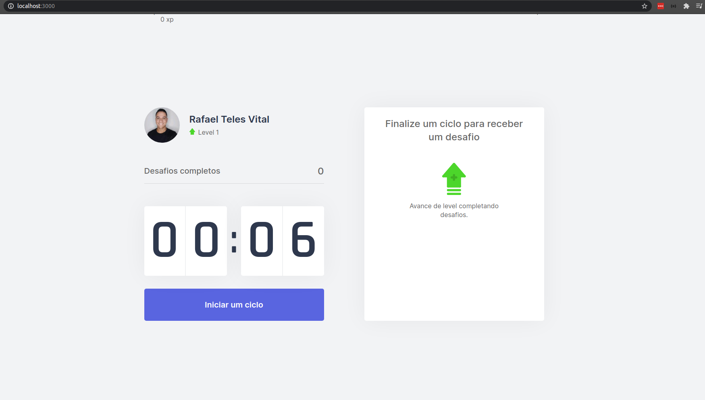
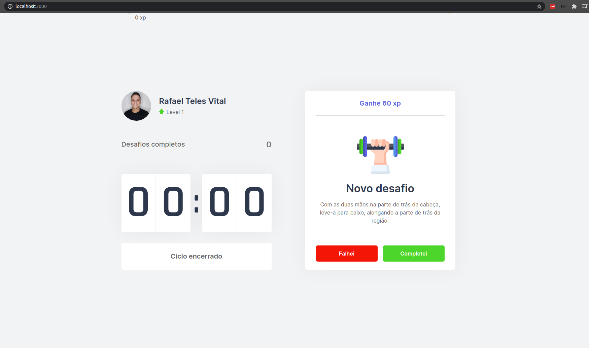
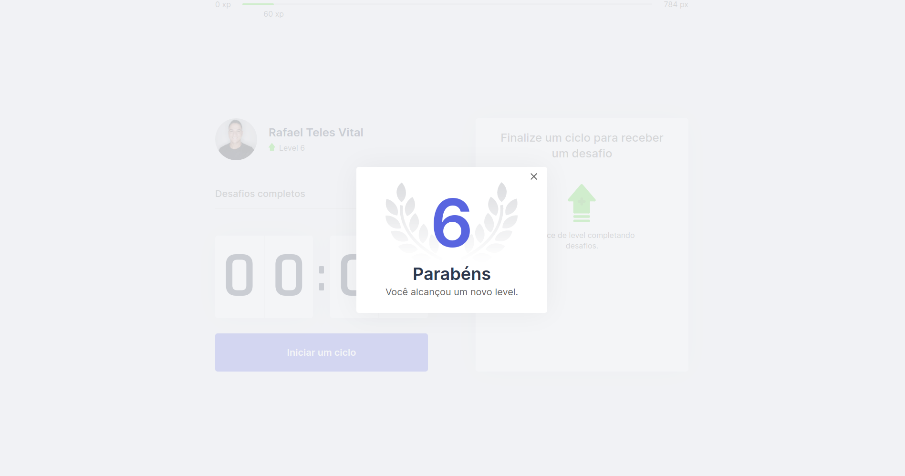

<h1>Resultado Final</h1>

<h1 align="center">
  Move.it
  <br /> 
   
  <br /> <br />
  Desafio Concluido!
  <br />
   
  <br /><br />
  Next level
  <br />
   
</h1>

## Deploy

<a href="https://moveit-rteles78.vercel.app/">Site</a> 

# `Indice`

<a href="#Next">1. Next</a> <br />
<a href="#Tecnologias-utilizadas">2. Tecnologias utilizadas</a> <br />
<a href="#Como-baixar-o-projeto">3. Como baixar o projeto</a>

## Next

Aplicação foi desenvolvida na semana do **NLW4** da **rocketseat**.

Período: 22/02 à 26/02

---

## Tecnologias utilizadas

O projeto foi desenvolvido utilizando as seguintes tecnologias:

- NextJs
- React
- TypeScript

---

## Código do dia

`#rumoaoproximonivel`

`#jornadainfinita`

`#focopraticagrupo`

`#neverstoplearning`

---
## Como baixar o projeto


```bash

  # Clonar o repositório
  $ git clone https://github.com/DevTeles/next-moviet.git

  # Entrar no diretório
  $ cd next-moviet

  # Instalar as dependências
  $ yarn

  # Iniciar o projeto
  $ yarn dev
```

<br /><br />
Desenvolvido por **Rafael Teles Vital**
